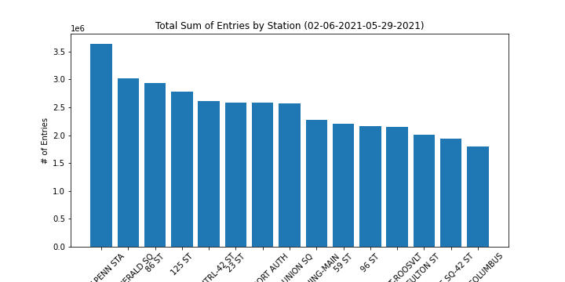
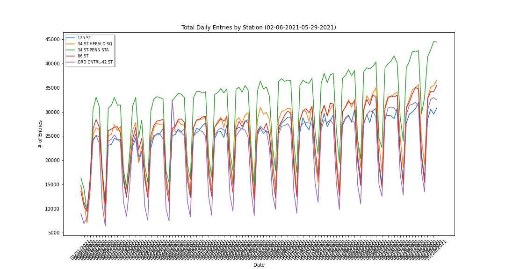
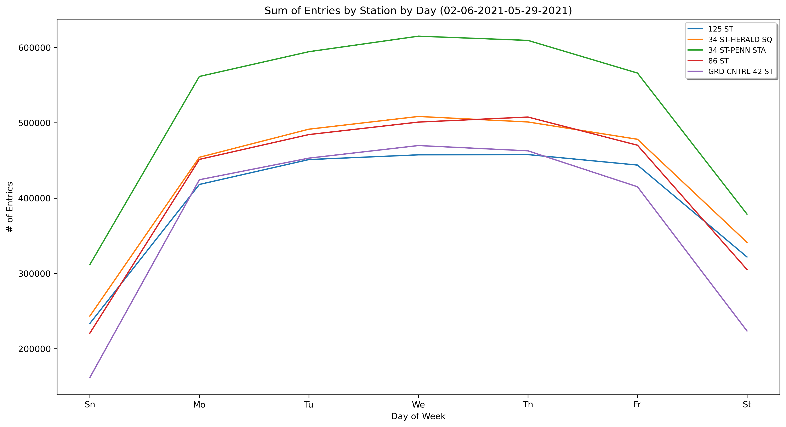

## Analysis of MTA Turnstile Data for WTWY

In this project, we are approached by a nonprofit organization seeking our data  science expertise to aid them in preparing for an upcoming fundraising event they will be hosting. The org, WomanTechWomanYes, are looking to use NYC MTA turnstile data (as found on  to better inform their street team subway station placement to both attract as many potential WTWY Annual Summer Gala attendees as possible and raise awareness to the public of their important mission.

We chose to approach this problem by looking at 4 months of MTA data preceding the gala (02/06/2021 - 05/29/2021) and attempting to determine the most trafficked stations in NYC, those stations' traffic trends through the chosen window of time, and a breakdown of total entries by the day of the week. 

In the first figure shown, we are arranging the top 15 most trafficked stations by their total sum of entries given the time-frame.

Because the bar chart here only gives us a rough idea of the *general* level of traffic over a longer period of time, we selected the 5 most heavily trafficked stations from this list and took a deeper diver into their daily trends to get a better sense of traffic trends over time and potentially identify traffic patterns. We can see the trends for these stations in the figure below. 

Finally, because WTWY are looking to identify ideal days to send their street teams out; as such, we are including this figure to identify the days the top stations are most frequented.

