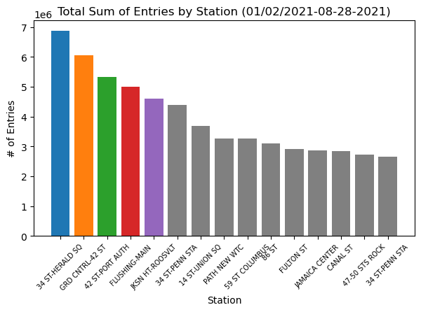

# Using Data Analytics to Inform and Improve WTWY Fundraising and Outreach
Matt Ryan

## Abstract

In this project, we are tasked with helping the non-profit organization, WomanTechWomanYes (WTWY), to both maximize attendance to their annual summer fundraising gala and spread awareness of their cause by using data analytics methods to optimize the deployment of their street teams. In order to aid WTWY in strategically scheduling their street teams to maximize engagement, we turned to New York City subway ridership [records](http://web.mta.info/developers/turnstile.html) and US census data to provide insight into both the most heavily trafficked stations, as well as the stations in areas with residents most likely/able to donate. 

## Design
With women only making up 27% of STEM workers despite accounting for nearly half the US workforce and only earning 85% their male counterparts according to 2019 Census Bureau estimates, the mission of WTWY is an important one. As such, WTWY being able to achieve high public engagement with their subway street teams using a data-driven approach is critical. Using the MTA data available to us, it is possible to take a more granular *approach* to our understanding of NYC metro-ridership, identifying key insights into high-traffic stations, times of day, and overall trends.

## Data

The base dataset used here is comprised of 1 year's worth of NYC MTA turnstile audit [records](http://web.mta.info/developers/turnstile.html), with the first and last turnstile audits records beginning on dates 01/04/2020 and 12/26/2020, respectively. Of interest, each turnstile audit record includes the turnstile's station and linename, the date and time the record was collected ***(the second of which generally falling into 1 of 6 uniform windows throughout the day)***, and running sums of entries and exits. We were able to use these fields to group our turnstiles into more granular sets ***to provide more insight***, and ultimately used one of these slices to determine 5 stations on which we performed further exploration and analysis.

## Algorithms

*Exploratory Data Analysis*
* Gathering data and setting up database
	* A python [script](https://github.com/maneaterrbug/WTWY_metro_project_MR/blob/master/build_mta_db.py) was written and used in conjunction with SQLite3 to build a local database by dynamically cycling through all .csv files found on the MTA website dependent within the desired timeframe and importing into a table in the local database
* Initial Cleaning
	* DATE to datetime
	* STATION and LINE_NAME concatenated
* Processing and manipulating our data 
	* By sorting the data into two initial dataframes, one grouped by day and one by time of record, the total amount of passengers that entered per turnstile over the course of the desired timeframe was able to be calculated using a pandas.DataFrame.diff() call. 
	* Using the daily dataframe, we were able to aggregate by unique station over our new entries value to determine the stations with the heaviest foot-traffic
	* From this list of high-volume stations, we identified the top 5 most-visited stations and applied them as a mask on our original date and time dataframes
	* Finally, aggregating functions such as .mean() and .sum() were applied to our newly organized dataframes to identify the most and least heavily trafficked days of the week and times of the day for each of our 5 stations
* Final Cleaning
	* During the course of the data processing and aggregation we discovered many abherrant records with potential to throw off any insights we might make
	* The newly calculated .diff() entries fields brought to light several new discrepancies with our data including:
		* reverse counting turnstiles leading to negative totals
		* long stretches of time during which data was not collected leading to extremely high .diff() values
		* turnstile counts being reset to 0 leading to negative values orders of magnitude larger than we might expect
		* large jumps up or down in cumulative entries count between 2 unique turnstiles' records in the dataset, leading to .diff() values orders of magnitude larger than we might expect
	* Which were accounted for by:
		* instead using the absoulute value of our .diff() entries using np.absolute()
		* filtering out absolute values that our unrealistically large (ie > 10,000 per day or > 2,000 for a 4 hour time-frame)
		* manually redefining our turnstiles switch-over .diff() values to null

## Tools

* SQLAlchemy for exploration and loading of data
* Numpy and Pandas for manipulation of data
* SQLite for higher level data exploration
* Matplotlib for data plotting/visualization

## Communication

